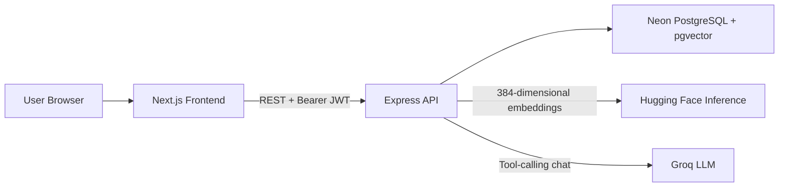

# MegaMart

An AI-powered, full-stack e-commerce platform featuring semantic product search, personalized recommendations, an LLM shopping concierge, transactional checkout, and vector similarity search.

MegaMart combines a modern Next.js storefront with an Express API, PostgreSQL/pgvector, Hugging Face embeddings, and Groq tool calling. The application is designed as a deployment-friendly monorepo and does not require a self-hosted machine-learning server.

## Highlights

- Semantic product search using natural-language queries
- Personalized recommendations based on purchase history
- AI shopping concierge capable of searching products, managing a cart, and checking out
- JWT authentication with bcrypt password hashing
- Transactional order creation and inventory updates
- PostgreSQL cosine similarity search using `pgvector`
- Graceful text-search fallback when the embedding provider is unavailable
- Detailed backend request, Hugging Face, and semantic-search logs
- Deployment-ready frontend and backend with validated environment configuration

## Architecture



| Layer | Technology | Responsibility |
|---|---|---|
| Frontend | Next.js 16, React 19, TypeScript, Tailwind CSS v4 | Storefront, auth UI, catalog, dashboard, search, orders, and chat |
| Core API | Node.js, Express 5, TypeScript | Authentication, products, orders, AI orchestration, and business logic |
| Database | Neon PostgreSQL, Prisma, pgvector | Users, products, carts/orders, inventory, and product embeddings |
| Embeddings | Hugging Face Inference API, `all-MiniLM-L6-v2` | Converts search and recommendation text into 384-dimensional vectors |
| Chat agent | Groq API with function calling | Product discovery, cart actions, and checkout through natural language |

The legacy FastAPI service in `backend/backend_python/` is retained for local ML experimentation only. It is not required to run or deploy MegaMart.

## Core Features

### Authentication

- Register with name, email, and password
- Passwords hashed using bcrypt
- Login returns a one-hour JWT
- Protected order, dashboard, and chat routes
- Backend refuses to start when critical environment variables are missing

### Product Catalog and Orders

- Browse the complete catalog
- View product details, specifications, reviews, and supplier information
- Create completed orders through the REST API
- Maintain a pending order as the AI-managed shopping cart
- Validate stock and calculate totals using database prices
- Use Prisma transactions for checkout and inventory updates

### Semantic Search

1. The user submits a natural-language query such as `device for coding`.
2. Node sends the text to Hugging Face.
3. `all-MiniLM-L6-v2` returns a normalized 384-dimensional vector.
4. PostgreSQL compares it with stored product vectors using cosine distance.
5. The closest products are returned with similarity scores.

If Hugging Face is unavailable or rate-limited, the API falls back to case-insensitive matching against product names, descriptions, and categories.

### Personalized Recommendations

1. The dashboard loads the categories from a user's previous orders.
2. Those categories are combined and embedded through Hugging Face.
3. pgvector finds the most semantically similar products.
4. New users receive the latest products as a cold-start fallback.

### AI Shopping Concierge

Groq provides the conversational layer and can invoke these backend tools:

- `searchCatalog`
- `viewCart`
- `addToCart`
- `checkoutCart`

If `GROQ_API_KEY` is absent or Groq fails, MegaMart uses a local rule-based fallback agent so the chat feature remains usable.

## Project Structure

```text
MegaMart/
├── frontend/
│   ├── app/
│   │   ├── dashboard/
│   │   ├── chat/
│   │   ├── login/
│   │   ├── orders/
│   │   ├── products/
│   │   ├── register/
│   │   └── search/
│   └── utils/api.ts
├── backend/
│   ├── backend_node/
│   │   ├── prisma/
│   │   │   ├── schema.prisma
│   │   │   ├── seed.ts
│   │   │   └── update_vectors.ts
│   │   └── src/
│   │       ├── config/
│   │       ├── controllers/
│   │       ├── middlewares/
│   │       ├── routes/
│   │       └── services/
│   └── backend_python/        # Optional legacy/local ML service
└── README.md
```

## API Overview

All Node routes are mounted below `/api`.

| Method | Endpoint | Authentication | Purpose |
|---|---|---|---|
| POST | `/api/auth/register` | Public | Create an account |
| POST | `/api/auth/login` | Public | Authenticate and return a JWT |
| GET | `/api/products` | Public | List products |
| GET | `/api/products/:id` | Public | Get product details |
| GET | `/api/search?q=...` | Public | Semantic product search |
| POST | `/api/orders` | JWT | Create a completed order |
| GET | `/api/orders` | JWT | Get the user's orders and pending cart |
| GET | `/api/dashboard` | JWT | Order statistics and personalized recommendations |
| POST | `/api/chat` | JWT | Use the AI shopping concierge |

## Data Model

- **User** — account identity and hashed credentials
- **Product** — catalog data, inventory, description, and `vector(384)` embedding
- **Order** — pending cart or completed purchase
- **OrderItem** — quantity and price snapshot linked to a product

Product vectors are generated from category, name, and description. The same `all-MiniLM-L6-v2` model must be used for both stored product vectors and live queries.

## Local Setup

### Prerequisites

- Node.js and npm
- A PostgreSQL database with the `pgvector` extension (Neon recommended)
- A Hugging Face token with **Make calls to Inference Providers** permission
- A Groq API key if real LLM chat is required

### 1. Configure the Node backend

Create `backend/backend_node/.env`:

```env
DATABASE_URL="your-pooled-postgresql-url"
DIRECT_URL="your-direct-postgresql-url"
JWT_SECRET="a-long-random-secret"
FRONTEND_URL="http://localhost:3001"
HF_API_KEY="your-hugging-face-token"
GROQ_API_KEY="your-groq-key"
PORT="3000"
```

`GROQ_API_KEY` is optional. `PORT` is optional and defaults to `3000`.

Install, build, and start:

```bash
cd backend/backend_node
npm install
npm run build
npm start
```

For development with automatic restart:

```bash
npm run dev
```

### 2. Configure the frontend

Create `frontend/.env`:

```env
NEXT_PUBLIC_API_URL="http://localhost:3000/api"
```

Then start the frontend explicitly on port 3001:

```bash
cd frontend
npm install
npm run dev -- -p 3001
```

Open `http://localhost:3001`.

### 3. Database setup

Apply committed migrations:

```bash
cd backend/backend_node
npx prisma migrate deploy
```

Seed the catalog when needed:

```bash
npx ts-node prisma/seed.ts
```

Generate or refresh product vectors:

```bash
npx ts-node prisma/update_vectors.ts
```

Existing vectors do not need regeneration when moving from the legacy Python service because both paths use the same model and dimension.

## Observability

Every backend request logs:

- Timestamp, HTTP method, and path
- Query parameters and redacted request body
- Origin, IP address, user agent, and presence of authentication
- Response status and total duration

Embedding logs explicitly show:

- Hugging Face provider and model
- Input length and retry attempt
- HTTP response status and latency
- Vector dimension, norm, sample values, and validation result
- Whether semantic search or the text fallback was used
- Returned products and similarity scores

Sensitive fields such as passwords, tokens, authorization headers, secrets, and API keys are redacted.

## Deployment

Recommended free-friendly deployment:

| Component | Host |
|---|---|
| Frontend | Vercel |
| Node API | Render or Railway |
| Database | Neon |
| Embeddings | Hugging Face Inference API |
| Chat | Groq API |

No Python service is required in production.

### Deploy the Node API

- Root directory: `backend/backend_node`
- Build command: `npm install && npm run build`
- Start command: `npm start`

Set:

```env
DATABASE_URL="production-pooled-url"
DIRECT_URL="production-direct-url"
JWT_SECRET="production-random-secret"
FRONTEND_URL="https://your-frontend.vercel.app"
HF_API_KEY="your-hugging-face-token"
GROQ_API_KEY="your-groq-key"
```

The platform supplies `PORT`; do not hardcode it in the hosting dashboard. The build runs `prisma generate` automatically.

### Deploy the frontend

- Import the repository into Vercel
- Set the root directory to `frontend`
- Set:

```env
NEXT_PUBLIC_API_URL="https://your-node-service.example.com/api"
```

This URL must point to the **Node backend**, include `/api`, and have no trailing slash. Redeploy the frontend whenever a `NEXT_PUBLIC_*` variable changes because Next.js embeds it at build time.

### Final production wiring

The services point to each other:

```text
Vercel NEXT_PUBLIC_API_URL → Node backend URL + /api
Node FRONTEND_URL          → Exact Vercel frontend origin
```

An incorrect `FRONTEND_URL` causes browser CORS errors. An incorrect `NEXT_PUBLIC_API_URL` causes frontend requests to return 404 or target localhost.

## Production Smoke Test

After deployment:

1. Open the Vercel URL.
2. Register a new user and log in.
3. Browse products and open a product page.
4. Search for a natural phrase and confirm the backend logs `HF EMBEDDING SUCCESS`.
5. Confirm the vector has 384 dimensions and semantic results show similarity scores.
6. Open the dashboard and verify recommendations.
7. Ask chat to find a product and add it to the cart.
8. View the cart, check out, and verify the order appears in order history.

## Reliability and Free-Tier Behaviour

- Free Node/database services may sleep, making the first request slower.
- Hugging Face free inference can return 503/504 or reach usage limits.
- Embedding calls retry transient failures; search then falls back to text matching.
- Groq free usage is rate-limited; chat falls back to the local agent.
- Core catalog, authentication, order, and inventory features do not depend on embeddings.

## Security Notes

- Never commit `.env` files.
- Store production secrets only in Vercel, Render, or Railway dashboards.
- Rotate any API key or database credential that has been exposed.
- Use a long, random production `JWT_SECRET`.
- The frontend stores JWTs in `localStorage`; this is acceptable for a portfolio demo but production systems should consider secure HttpOnly cookies and refresh-token rotation.

## Build Commands

```bash
# Backend type-check/build + Prisma client generation
cd backend/backend_node
npm run build

# Frontend production build
cd frontend
npm run build
```

---

MegaMart demonstrates end-to-end ownership across frontend engineering, REST APIs, authentication, relational data modeling, transactions, vector databases, hosted ML inference, LLM tool calling, graceful degradation, deployment configuration, and observability.
